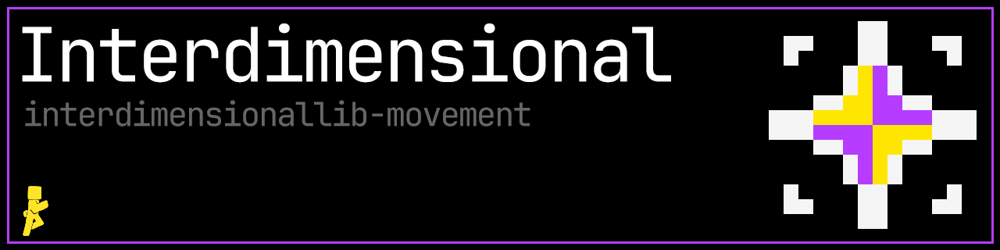

# InterdimensionalLib Movement
This is part of [InterdimensionalLib](https://github.com/crystallized-dreams/interdimensionallib)
## Features
Adds support for crawling and sitting in-game as a library. But yeah - it can be used as a mod too.